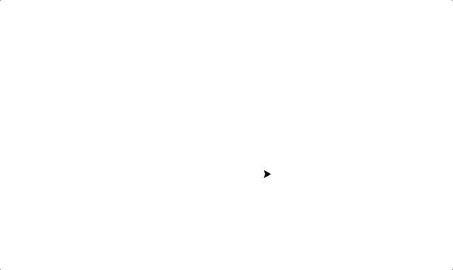
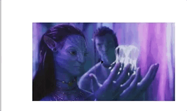
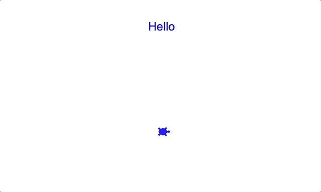

<a name="readme-top"></a>
# Turtle

<div align="center">
<!-- Title: -->
<h1><a href="https://github.com/skthati/Turtle/">Python Turtle</a> - Algorithms </h1>
</div>

<!-- Table of contents -->
<hr>
<hr>
<ol>
    <li><a href="#basics">Basics</a> </li>
</ol>
<hr>
<hr>


<!-- Basics -->
## Basics <a name="basics"></a>
Python turtle is a module in Python to learn programming concepts through drawing and animation. Using turtle module we can create simple texts, shapes to complex graphics.

Below code displays turtle on the screen.
```Python
from turtle import Turtle, Screen

t = Turtle()
ts = Screen()
t.shape("turtle")
t.color("blue")

ts.exitonclick()
```

Output


<p align="right">(<a href="#readme-top">back to top</a>)</p>
<hr>


<!-- Dotted Line -->
## Dotted Line <a name="dotted-line"></a>
Using Turtle drawing dotted line.

Code
```Python
# Draw a dashed line
for _ in range(10):
    t.forward(10)
    t.penup()
    t.forward(10)
    t.pendown()
```
Output


<p align="right">(<a href="#readme-top">back to top</a>)</p>

<hr>
<!-- Draw a square -->
## Draw a square <a name="draw-a-square"></a>
Draw a square

Code.
```Python
# Draw a square

for i in range(4):
    t.forward(100)
    t.right(90)
   ```
Output.


<p align="right">(<a href="#readme-top">back to top</a>)</p>
<hr>

<!-- Draw Shapes -->
## Draw Shapes <a name="draw-shapes"></a>
Draw triangle, square, upto 10 sides with each random color.

[Code file](Draw%20shapes%20with%20side%20increment.py)
```python
#  Draw triangle, square, upto 10 sides with each random color

c = ["red", "yellow", "blue", "green", "black", "pink", "orange", "gray", "purple"]

sides = 3
while sides < 10:
    for _ in range(sides):
        shape = 360 / sides
        t.forward(100)
        t.right(shape)
    t.color(random.choice(c))
    sides += 1
```
Output


<p align="right">(<a href="#readme-top">back to top</a>)</p>
<hr>

<!-- Random Colors -->
## Generate Random Colors <a name="generate-random-color"></a>
Generate random color

Code
```Python
ts = Screen()

def random_color():
    r = random.randint(0, 255)
    g = random.randint(0, 255)
    b = random.randint(0, 255)
    random_color1 = (r,g,b)
    return random_color1


ts.colormode(255)
```

<p align="right">(<a href="#readme-top">back to top</a>)</p>
<hr>

<!-- Random Walk -->
## Random Walk <a name="random-walk"></a>
Random walk with random color.

[Code file location](random_walk.py)

Functions for directions.
```Python
def forward():
    return t.forward(20)

def right():
    return t.right(90)

def left():
    return t.left(90)

def back():
    return t.back(20)

def func(x):
    return x()
```
Place all functions in a list and call the random method to select an item from the list.

```Python
lst1 = [forward, right, left, back]

way = random.choice(lst1)
func(way)
```
more code
```Python
for _ in range(50):
    t.forward(20)
    tup = random_color()
    t.color(tup)
    way = random.choice(lst1)
    func(way)
```

Output

<p align="right">(<a href="#readme-top">back to top</a>)</p>
<hr>

<!-- Turtles Race -->
## Turtles Race <a name="turtles-race"></a>
Simple Turtles race.
* Turtles with random color.
* Race stops when the turtle touches the finish line.

Create turtle instance, assign random color and position.
```Python
for i in range(4):
    players_lst[i] = Turtle()
    t = players_lst[i]
    t.penup()
    t.color(random_color())
    t.shape("turtle")
    t.goto(-250, (-100+j))
    j += 50
```

Race turtles and declare winner.

```Python
while x < 230:
    for i in range(4):
        x, x1 = players_lst[i].position()
        players_lst[i].forward(random_speed())
        a, b = players_lst[i].position()
        if a >= 230:
            print(f"{players_lst[i]} Won the race!")
            break
```

Output


[Code file location](turtle_race_final.py)

My son likes Avatar, So added background pic.



<p align="right">(<a href="#readme-top">back to top</a>)</p>
<hr>  

<!-- Move Turtle using keys -->
## Move turtle with keys <a name="move_turtle_with_keys"></a>
Move Turtle using up, down, left, right keys.
Change Turtle color on every move.

[Code File Location](Move_turtle_with_keys.py)

code
```Python
ts.listen()
ts.onkey(key="Up", fun=move_forward)
ts.onkey(key="Right", fun=right_move)
ts.onkey(key="Left", fun=left_move)
ts.onkey(key="Down", fun=move_backward)
ts.onkey(key="space", fun=go_home)
```
Output


<p align="right">(<a href="#readme-top">back to top</a>)</p>
<hr>  

<!-- abc 

Test1 
## Test1 <a name="test1"></a>
Test1

1. Output
    ```sh
   test1
   ```
2. Variables
3. Output

<p align="right">(<a href="#readme-top">back to top</a>)</p>
<hr>  

       -->


